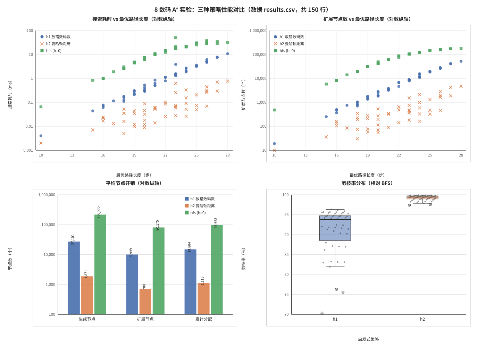
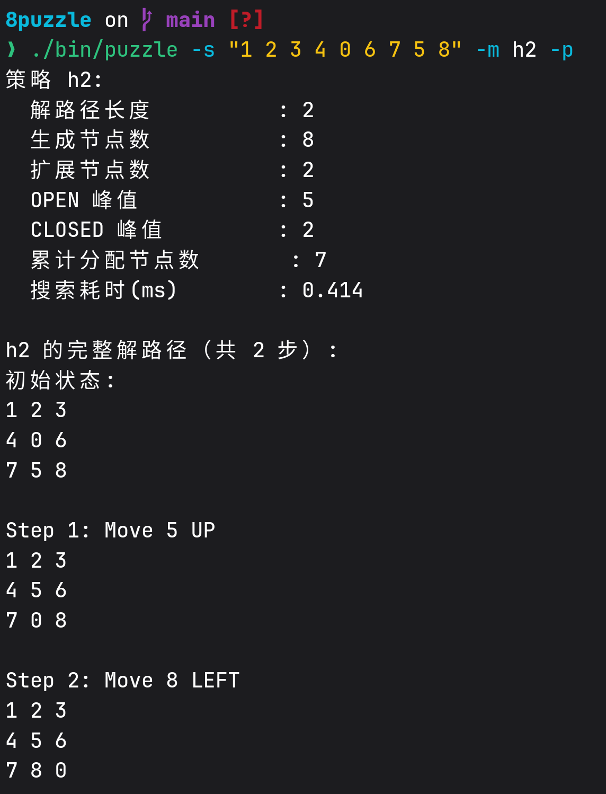
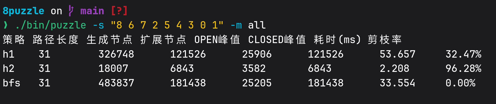
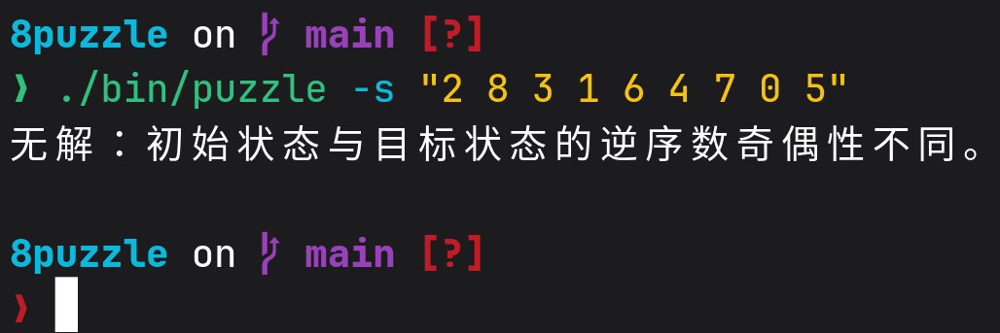
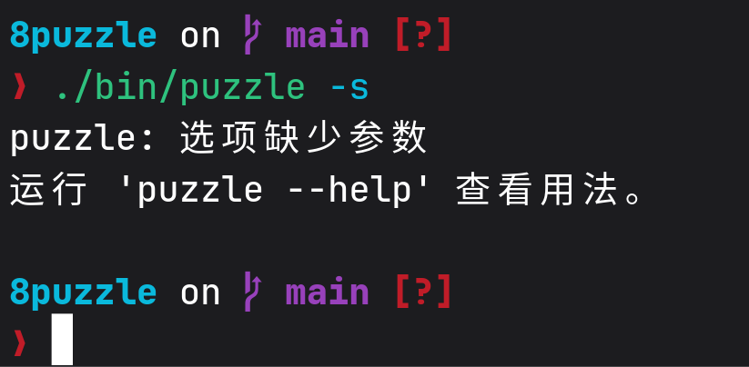

# A* 算法求解 8 数码问题实验报告

## 基本信息

| 项目 | 内容 |
| --- | --- |
| 报告标题 | 《A* 算法求解 8 数码问题实验报告》 |
| 学号 | 25270230 |
| 姓名 | Alexander Hou |
| 提交日期 | 2026.10.04 |

---

## 1. 实验目的

1. 熟悉并掌握启发式搜索的基本定义、估价函数与 A* 算法流程；
2. 以 8 数码问题为例实现 A* 求解程序，理解求解流程与搜索顺序；
3. 通过对比 $h_1$（放错数码数）、$h_2$（曼哈顿距离）与 BFS（$h \equiv 0$）三种策略，定量分析启发式信息对搜索效率的影响。


## 2. 实验原理

### 2.1 启发式搜索与估价函数

* A* 的核心是估价函数 $f(n) = g(n) + h(n)$：$g(n)$ 为从起始节点到 $n$ 的实际代价，$h(n)$ 为从 $n$ 到目标节点的估计代价。
* A* 每次从 OPEN 表中取出 $f$ 值最小的节点扩展；当 $h \equiv 0$ 时退化为逐层扩展的盲目搜索（作为基准的 BFS）。
* 8 数码中每步移动代价恒为 1，因此 $g(n)$ 就是从起点到 $n$ 的步数。

### 2.2 两种启发函数

| 函数 | 表达式 | 含义 | 理论性质 |
| --- | --- | --- | --- |
| $h_1$ | 位置不匹配的非空格数码个数 | 只看"对/错"，信息较粗 | 可采纳且一致 |
| $h_2$ | 各数码到目标位置的曼哈顿距离之和 | 兼顾距离，信息更细 | 可采纳且一致 |

### 2.3 BFS 与 A* 的关系

本实验的 BFS 即 $h \equiv 0$ 的 A*：此时 $f \equiv g$，弹出顺序按层递增，等价于层序搜索；同一层内的扩展顺序由确定性比较器决定，而非队列 FIFO，因此节点计数与教科书 FIFO-BFS 略有差异，全实验统一采用本程序口径。

### 2.4 可采纳性与一致性

* **可采纳性**：$h(n) \le h^*(n)$。8 数码中每移动一步最多让一个数码靠近目标一步，故曼哈顿距离不会高估剩余步数；放错数码数同理。可采纳性是"弹出目标节点时得到的路径一定最优"的依据。
* **一致性**：$|h(n) - h(n')| \le 1$（相邻状态间）。一致性保证一个状态被扩展（关闭）时其 $g$ 已是最优，因此无需重新打开已关闭节点，这正是本项目"状态表 + 惰性删除"设计的正确性前提。


## 3. 算法设计

### 3.1 数据结构

* **`Node`**：3×3 状态、空格坐标、$g/h/f$、`parent`，以及状态编码缓存 `code`；
* **OPEN 表**：小顶堆，比较器为 $f$ 升序 → $g$ 降序 → $h$ 升序 → 状态编码升序；最后一级保证并列时顺序唯一，使结果完全可复现；
* **状态表**：一张哈希表统一记录所有**已发现**状态（覆盖 OPEN 与 CLOSED），每条记录保存 `best_g`、取得该 $g$ 的规范节点与是否已关闭；
* **Node 内存池**：按块批量分配，程序结束一次性释放，从结构上排除泄漏与二次释放。

### 3.2 求解流程框图

```text
[开始]
  |
  v
解析命令行参数 ---(用法错误)---> 报错 + 用法提示 ---> [退出码 1]
  |
  v
输入合法性校验（恰好 9 个数，且为 0..8 各一次）
  |
  v
逆序数奇偶性判定 ---(奇偶不同)---> 提示无解 ---> [退出码 2]
  |
  v  (奇偶相同：可解)
创建 内存池 / 状态表 / 小顶堆；创建初始节点，登记状态表并压入堆
  |
  v
<< 循环开始 >>
  |
  OPEN 表为空？---(是)---> 搜索失败/无解 ---> [退出码 2]
  |
 (否)
  |
  v
弹出 f 最小的堆顶节点
  |
  已关闭 或 node->g != best_g？---(是)---> 丢弃该引用，回到 << 循环开始 >>
  |
 (否)
  |
  v
是目标状态？---(是)---> 目标节点不标记 closed、不计入 expanded ---> 交由 reporter 输出 ---> [退出码 0]
  |
 (否)
  |
  v
标记 closed，expanded++；生成上下左右可达子节点（过滤越界），计算 g/h/f
  |
  v
对每个子节点与状态表 best_g 比较：
  - 无记录            ---> 登记 + 入堆
  - best_g <= g_new   ---> 丢弃（generated 仍计数）
  - best_g >  g_new   ---> 更新记录 + 入堆（旧堆条目转为过期）
  |
  +---> 回到 << 循环开始 >>

结束：先释放堆与状态表结构，最后 pool_free_all 一次性释放全部 Node。
```

### 3.3 核心代码摘录

**（1）确定性比较器**（`src/heap.c`）——最后一级用状态编码兜底，保证同一输入多次运行结果一致：

```c
int compare_nodes(const Node* a, const Node* b)
{
    if (a->f != b->f) return (a->f < b->f) ? -1 : 1;
    if (a->g != b->g) return (a->g > b->g) ? -1 : 1; /* f 相同时优先更深节点 */
    if (a->h != b->h) return (a->h < b->h) ? -1 : 1;
    if (a->code != b->code) return (a->code < b->code) ? -1 : 1;
    return 0;
}
```

**（2）搜索主循环核心**（`src/puzzle.c`，节选）——目标在**弹出时**判定；状态表统一记录已发现状态的最优 $g$；

```c
Node* node = heap_pop(heap);
entry = table_find(table, node->code);
if (entry == NULL || entry->closed || entry->best_g != node->g) {
    continue;                        /* 过期或重复条目，惰性跳过 */
}
if (node->code == goal_code) {       /* 弹出时判定目标：最优性关键 */
    goal = node;
    break;
}
entry->closed = true;
expanded++;
...
code = state_encode(next_view);
found = table_find(table, code);
if (found != NULL && found->best_g <= node->g + 1) {
    continue;                        /* 已有不劣于该路径的记录：丢弃候选 */
}
child = make_node(pool, next_view, code, target, h_func, node->g + 1, node);
if (found == NULL) table_insert(table, code, child->g, child);
else               table_update(found, child->g, child);
heap_push(heap, child);
```

**（3）状态编码与哈希**（`src/puzzle.c`、`src/state_table.c`）——base-9 一一编码，乘法混合后取桶掩码，避免低位聚集：

```c
unsigned int state_encode(const int state[3][3])
{
    unsigned int code = 0;
    for (int i = 0; i < 3; i++)
        for (int j = 0; j < 3; j++)
            code = code * 9u + (unsigned int)state[i][j];
    return code;                     /* 取值 0 .. 9^9-1 */
}

static unsigned int mix_hash(unsigned int x)
{
    x ^= x >> 16;  x *= 0x7feb352du;
    x ^= x >> 15;  x *= 0x846ca68bu;
    x ^= x >> 16;
    return x;
}
```

**（4）曼哈顿距离**（`src/puzzle.c`）——按传入的 target 建立"数码 → 目标坐标"映射，因此支持任意目标状态：

```c
for (i = 0; i < 3; i++)
    for (j = 0; j < 3; j++) {
        target_row[target[i][j]] = i;
        target_col[target[i][j]] = j;
    }
/* 再对每个非空格数码累加 |dr| + |dc| */
```


## 4. 实验环境

| 项目 | 配置 |
| --- | --- |
| CPU | Intel(R) Core(TM) Ultra 7 255H，16 核 / 16 线程 |
| 内存 | 30 GiB |
| 操作系统 | Arch Linux，内核 7.2.8-arch1-2，x86_64 |
| 编译器 | gcc (GCC) 16.2.1 |
| 编译选项 | `-std=c11 -Wall -Wextra -O2`（不依赖任何第三方库） |
| 计时方式 | `clock_gettime(CLOCK_MONOTONIC)`，仅统计搜索主循环 |
| 测量方式 | 每个实例重复运行 5 次，表格中为各指标中位数 |
| 批量基准 | `-b 50 --seed 20261020`，随机初态由固定种子的 xorshift32 生成 |


## 5. 实验方案

### 5.1 控制变量

同一初始状态、同一目标状态 `1 2 3 4 5 6 7 8 0`，分别用 `h1`、`h2`、`bfs` 三种策略求解，记录路径长度、生成节点数、扩展节点数、OPEN/CLOSED 峰值与耗时。

### 5.2 固定初始状态集合

| 编号 | 初始状态 | 逆序数 | 可解 | 最优步数 |
| --- | --- | --- | --- | --- |
| S1 | `1 2 3 4 0 6 7 5 8` | 2 | 是 | 2 |
| S4 | `0 1 2 3 4 5 6 7 8` | 0 | 是 | 22 |
| REV | `8 7 6 5 4 3 2 1 0` | 28 | 是 | 30 |
| S3 | `8 6 7 2 5 4 3 0 1` | 24 | 是 | 31（8 数码最长解） |
| S2 | `2 8 3 1 6 4 7 0 5` | 11 | **否** | — |

最优步数由独立的 BFS 脚本与程序三种策略交叉验证得到，四组数据完全一致。

### 5.3 批量基准

```sh
./bin/puzzle -b 50 --seed 20261020 --csv results.csv
```

批量模式用固定种子生成 50 个可解初态（跳过"初态即目标"的平凡实例），对每个初态依次运行三种策略，CSV 每行对应一次"初态 × 策略"。


## 6. 实验结果

### 6.1 单例对比（重复 5 次取中位数）

| 初态 | 策略 | 路径长度 | 生成节点数 | 扩展节点数 | OPEN 峰值 | CLOSED 峰值 | 耗时(ms) | 剪枝率 |
| --- | --- | --- | --- | --- | --- | --- | --- | --- |
| S1 | h1 | 2 | 8 | 2 | 5 | 2 | 0.001 | 68.00% |
| S1 | h2 | 2 | 8 | 2 | 5 | 2 | 0.000 | 68.00% |
| S1 | bfs | 2 | 25 | 9 | 8 | 9 | 0.001 | 基准 |
| S4 | h1 | 22 | 14,886 | 5,472 | 3,173 | 5,472 | 1.089 | 92.79% |
| S4 | h2 | 22 | 2,107 | 784 | 480 | 784 | 0.129 | 98.98% |
| S4 | bfs | 22 | 206,475 | 76,709 | 23,952 | 76,709 | 13.300 | 基准 |
| REV | h1 | 30 | 250,275 | 92,906 | 24,729 | 92,906 | 23.611 | 48.24% |
| REV | h2 | 30 | 19,405 | 7,318 | 3,817 | 7,318 | 1.197 | 95.99% |
| REV | bfs | 30 | 483,547 | 181,316 | 24,145 | 181,316 | 32.154 | 基准 |
| S3 | h1 | 31 | 326,748 | 121,526 | 25,906 | 121,526 | 25.831 | 32.47% |
| S3 | h2 | 31 | 18,007 | 6,843 | 3,582 | 6,843 | 1.114 | 96.28% |
| S3 | bfs | 31 | 483,837 | 181,438 | 25,205 | 181,438 | 31.930 | 基准 |

### 6.2 批量基准汇总

下图由 `./bin/puzzle -b 50 --seed 20261020 --csv results.csv` 生成的指标数据绘制（绘图脚本：`scripts/show_graph.py`，固定种子保证可复现），四张子图分别从耗时、扩展节点数、平均节点开销与剪枝率四个角度对比三种策略。



以下是 50 个可解初态的平均值：

| 策略 | 平均路径长度 | 平均生成节点数 | 平均扩展节点数 | 平均 OPEN 峰值 | 平均耗时(ms) | 平均剪枝率 |
| --- | --- | --- | --- | --- | --- | --- |
| h1 | 21.42 | 27,101.4 | 9,999.5 | 4,860.8 | 1.987 | 90.91% |
| h2 | 21.42 | 1,871.0 | 700.4 | 406.8 | 0.127 | 99.18% |
| bfs | 21.42 | 215,272.2 | 80,175.2 | 18,709.5 | 13.947 | 基准 |

**图表解读**

1. **耗时随难度增长，且三种策略的差距随难度被放大**（子图 1）。在最容易的 10 步实例上，三者耗时都在 0.1 ms 以内；到最难的 28 步实例上，$h_2$ 仍只需 0.774 ms，而 $h_1$ 需要 10.78 ms、BFS 需要 31.26 ms——同一实例上 $h_2$ 比 BFS 快约 40 倍。三条点带随路径长度单调抬升，说明搜索规模由实例难度主导，而启发式的强弱决定抬升的快慢。
2. **扩展节点数跨越 4 个数量级并明显分层**（子图 2，纵轴为对数刻度）。BFS 的点带最高（中位数 69,188，最大 177,471），$h_1$ 居中（中位数 4,215，最大 52,020），$h_2$ 始终贴底（中位数 326，最大 4,708）。50 个实例上，BFS 的扩展节点数是 $h_2$ 的 37.7～748.6 倍（中位 170.6 倍）。
3. **平均节点开销的柱状对比**（子图 3）。生成节点数的平均值 $h_1$ / $h_2$ / BFS 分别为 27,101 / 1,871 / 215,272，扩展节点数为 9,999 / 700 / 80,175：启发式越准确，被真正展开的状态越少，同时留在 OPEN 表中的峰值也同步下降（4,861 / 407 / 18,710）。
4. **剪枝率分布体现稳定性差异**（子图 4）。$h_2$ 的剪枝率紧贴 99%～100%（中位 99.42%，最低 97.36%），分布极窄；$h_1$ 中位 93.77%，但左尾一直拖到 70.31%。也就是说 $h_1$ 在部分实例上会明显失灵，而 $h_2$ 的表现始终稳定。

另外两点值得注意：

* 50 个实例上三种策略给出的路径长度**完全一致**（均为 10～28 步），再次印证三者都求出了最优解；
* 在最难的 28 步实例上，$h_1$ 的扩展节点数（52,020）反而超过 $h_2$（4,708）十倍以上，说明"放错数码数"只在短路径上够用，路径一长就明显信息不足。

### 6.3 运行输出（截图）

**（1）单策略 + 完整路径**（截图命令：`./bin/puzzle -s "1 2 3 4 0 6 7 5 8" -m h2 -p`）



**（2）三策略对比表**（截图命令：`./bin/puzzle -s "8 6 7 2 5 4 3 0 1" -m all`）



**（3）不可解判定**（截图命令：`./bin/puzzle -s "2 8 3 1 6 4 7 0 5"`）



**（4）输入非法**（截图命令：`./bin/puzzle -s`）




## 7. 分析与讨论

### 7.1 启发函数与代价函数的作用

$g(n)$ 记录已付出的实际步数，是"路径代价"的累积，它保证 A* 不会用代价更大的路径替换更优路径，也是最终路径长度的来源；$h(n)$ 则给出"还差多少"的估计，决定搜索往哪个方向走。二者相加得到的 $f(n)$ 同时兼顾"已付出的代价"与"预估的代价"，这正是 A* 优于纯贪心与纯盲目搜索的原因。

实验中 $h$ 的质量直接反映在搜索规模上：S3 难例中，$h_1$ 只剪掉 32.47% 的候选节点，而 $h_2$ 剪掉 96.28%；扩展节点数从 BFS 的 181,438 降到 $h_1$ 的 121,526、再降到 $h_2$ 的 6,843，相差约 **26 倍**。原因是 $h_1$ 只区分"对/错"，一个需要走 4 步才能归位的数码与只差 1 步的数码被同等看待；$h_2$ 则按距离精确计数，信息量更大、更接近真实剩余代价。

### 7.2 三种策略的趋势对比

* **路径长度**：4 组实例、12 次运行，三种策略得到的路径长度完全一致（2 / 22 / 30 / 31 步），验证了三种策略都求出最优解。
* **生成/扩展节点数**：始终满足 $\text{bfs} > h_1 > h_2$。批量 50 例的平均扩展节点数为 80,175（bfs）→ 9,999（$h_1$）→ 700（$h_2$）。
* **耗时**：与节点规模同向。S3 上 $h_2$ 用时 1.114 ms，$h_1$ 25.831 ms，BFS 31.930 ms，$h_2$ 比 BFS 快约 **28 倍**。
* **空间**：OPEN 峰值同样呈该趋势（S3：25,205 → 25,906 → 3,582）。启发式越好，需要同时留在 OPEN 表中的节点越少，内存占用越低。
* **注意**：S1（仅差 2 步）这种简单实例中，$h_1$ 与 $h_2$ 的所有指标完全相同（生成 8、扩展 2、OPEN 峰值 5）。这与"趋势是 ≥ 而非严格 >"的预期一致——实例越简单，两种启发式的差异越容易被摊平；差异要在中长路径实例上才明显。

### 7.3 可采纳性与最优性的验证

程序在每次求解后都做了两项交叉验证：一是三种策略路径长度必须相等；二是路径长度不小于 $h_2(\text{start})$（可采纳性给出的下界）。实测两者均成立，说明实现没有破坏可采纳性与一致性带来的最优性保证。`--selftest` 把这两项连同"路径可逐步回放至目标"一起固化成了内建断言。

### 7.4 空间复杂度与状态去重

* 8 数码可达状态只有 9!/2 = 181,440 个。用不可解初态 S2 做 BFS 时，程序恰好扩展 181,440 个节点后停止——正好等于初态所在的连通分量大小，反过来也验证了"奇偶性把状态空间均分成两个等大分量"这一结论。
* 状态表用一张哈希表统一记录所有已发现状态的最优 $g$（覆盖 OPEN 与 CLOSED），配合"弹出时判过期"的惰性删除，保证每个状态最多被真正展开一次。若只用 CLOSED 表过滤，同一状态会以不同 $g$ 多次入堆、被重复展开，扩展节点数会虚高。
* 内存上，`generated`（候选子节点数）与 `total_alloc_nodes`（实际分配数）是两个不同的量：被 `best_g` 比较直接丢弃的候选只计数、不分配节点，因此总有 `total_alloc_nodes <= generated`。以 S3 为例：$h_2$ 生成 18,007 个候选、实际只分配 10,539 个节点；BFS 生成 483,837 个候选、实际分配 181,440 个——**恰好等于连通分量大小**，说明每个状态只被登记一次，去重完全生效。

### 7.5 自己的观点与额外工作量

1. **"见过就丢弃"是错的**：在一致启发式下，某个状态首次被生成时并不一定拿到最优 $g$。因此本实现保留了 `best_g` 比较与惰性删除，而不是简单地"出现过就跳过"，这是保证最优性的关键细节。
2. **可复现性设计**：堆比较器追加状态编码作为最后一级 tie-break，批量模式的随机初态用固定种子的 xorshift32 生成、并保证可解且非平凡。因此同一 `--seed` 下除耗时列外的输出逐字节一致，实验结果可以被完整复现。
3. **工程化验证**：除 6 个单元测试程序（共 866 条断言）外，还提供了 `--selftest` 内建自检与 `tests/run_tests.sh` 黑盒验收；全部源码在 `-Wall -Wextra` 下零告警，并通过 AddressSanitizer / UndefinedBehaviorSanitizer 检查，Valgrind 报 All heap blocks were freed -- no leaks are possible，无内存泄漏。
4. **指标口径的取舍**：`generated` 与 `total_alloc_nodes` 分离、`peak_closed == expanded` 的恒等式、剪枝率以百分比写入 CSV，都是为了让三种策略可横向比较、数据可直接作图。
5. **计时注意**：本机 CPU 为大小核混合架构，毫秒级计时存在波动，因此表格统一采用重复 5 次的中位数；简单实例（如 S1）耗时低于计时精度，数值仅供参考。


## 8. 总结

1. 三种策略在全部测试实例上给出相同的最优路径长度，验证了 $h_1$、$h_2$ 的可采纳性与实现的正确性。
2. 启发式信息显著影响搜索规模：$h_2$ 的扩展节点数比 BFS 少 1~2 个数量级（难例上约 26 倍差距），耗时与内存峰值同向下降。
3. 启发式质量越接近真实剩余代价，剪枝越强：$h_2 > h_1 \gg$ 无启发，批量 50 例的平均剪枝率分别为 99.18%、90.91% 和 0%。
4. 状态表 + 惰性删除 + 内存池的组合，使程序在最优性、内存安全与可复现性三方面都有保障。
